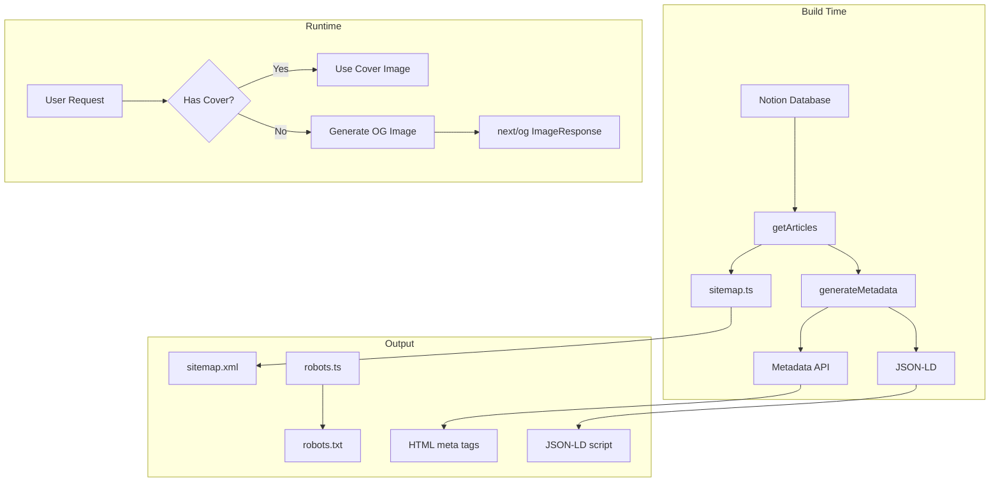

# SEO/GEO 优化方案设计文档

## Overview

本设计文档描述了为 natureblueee 个人博客实现 SEO（搜索引擎优化）和 GEO（生成式引擎优化）的技术方案。方案基于 Next.js 16 App Router 原生功能，最小化外部依赖，确保轻量、稳健、易维护。

### 设计原则

1. **原生优先** - 优先使用 Next.js 16 内置功能
2. **零运行时开销** - 所有 SEO 资源在构建时生成
3. **渐进式降级** - 错误不影响用户体验
4. **类型安全** - 使用 TypeScript 确保配置正确

### 技术栈

| 功能       | 技术方案                |
| ---------- | ----------------------- |
| 元数据     | Next.js Metadata API    |
| 结构化数据 | schema-dts + JSON-LD    |
| Sitemap    | app/sitemap.ts          |
| Robots     | app/robots.ts           |
| OG 图片    | next/og (ImageResponse) |

## Architecture

### 目录结构

```
src/
├── app/
│   ├── sitemap.ts          # 站点地图生成
│   ├── robots.ts           # 爬虫指令
│   ├── og/
│   │   └── route.tsx       # 动态 OG 图片 API
│   ├── layout.tsx          # 根布局（全局元数据）
│   ├── page.tsx            # 首页
│   └── posts/
│       └── [id]/
│           └── page.tsx    # 文章详情页
├── lib/
│   └── seo/
│       ├── index.ts        # 统一导出
│       ├── config.ts       # SEO 配置
│       ├── metadata.ts     # 元数据生成工具
│       ├── structured-data.ts  # JSON-LD 生成
│       └── types.ts        # 类型定义
└── config/
    └── site.ts             # 站点配置（已存在，扩展）
```

### 数据流



## Components and Interfaces

### 1. SEO 配置 (src/lib/seo/config.ts)

```typescript
/**
 * SEO 配置接口
 */
export interface SEOConfig {
  /** 站点名称 */
  siteName: string;
  /** 站点描述 */
  siteDescription: string;
  /** 站点 URL */
  siteUrl: string;
  /** 默认语言 */
  defaultLocale: "zh-CN" | "en";
  /** 作者信息 */
  author: {
    name: string;
    url?: string;
  };
  /** 社交媒体 */
  social?: {
    twitter?: string;
  };
  /** OG 图片配置 */
  ogImage: {
    width: number;
    height: number;
    /** 背景色（宣纸白） */
    backgroundColor: string;
    /** 文字色（焦墨） */
    textColor: string;
    /** 强调色（泥金） */
    accentColor: string;
  };
  /** 站点验证 */
  verification?: {
    google?: string;
    bing?: string;
  };
}

/**
 * 默认 SEO 配置
 */
export const seoConfig: SEOConfig = {
  siteName: "natureblueee",
  siteDescription: "思想的数字石碑 - 一个记录光怪陆离想法与持久美学追求的空间",
  siteUrl:
    process.env.NEXT_PUBLIC_SITE_URL || "https://natureblueee.vercel.app",
  defaultLocale: "zh-CN",
  author: {
    name: "Natureblueee",
    url: "https://wowok.net",
  },
  ogImage: {
    width: 1200,
    height: 630,
    backgroundColor: "#F5F5F5", // 宣纸白
    textColor: "#1A1A1A", // 焦墨
    accentColor: "#C5A059", // 泥金
  },
  verification: {
    google: process.env.GOOGLE_SITE_VERIFICATION,
    bing: process.env.BING_SITE_VERIFICATION,
  },
};
```

### 2. 元数据生成工具 (src/lib/seo/metadata.ts)

```typescript
import type { Metadata } from "next";
import { seoConfig } from "./config";

/**
 * 文章元数据输入
 */
export interface ArticleMetadataInput {
  title: string;
  description?: string;
  publishedAt?: string;
  modifiedAt?: string;
  cover?: string;
  url: string;
  language?: "zh" | "en";
}

/**
 * 生成文章页面元数据
 */
export function generateArticleMetadata(
  article: ArticleMetadataInput
): Metadata {
  const {
    title,
    description,
    publishedAt,
    cover,
    url,
    language = "zh",
  } = article;

  const fullTitle = `${title} | ${seoConfig.siteName}`;
  const desc = description || `${title} - ${seoConfig.author.name}`;
  const ogImageUrl =
    cover || `${seoConfig.siteUrl}/og?title=${encodeURIComponent(title)}`;

  return {
    title: fullTitle,
    description: desc,
    alternates: {
      canonical: url,
    },
    openGraph: {
      title,
      description: desc,
      url,
      siteName: seoConfig.siteName,
      type: "article",
      publishedTime: publishedAt,
      authors: [seoConfig.author.name],
      locale: language === "zh" ? "zh_CN" : "en_US",
      images: [
        {
          url: ogImageUrl,
          width: seoConfig.ogImage.width,
          height: seoConfig.ogImage.height,
          alt: title,
        },
      ],
    },
    twitter: {
      card: "summary_large_image",
      title,
      description: desc,
      images: [ogImageUrl],
    },
  };
}

/**
 * 生成页面元数据（通用）
 */
export function generatePageMetadata(options: {
  title: string;
  description?: string;
  url: string;
}): Metadata {
  const { title, description, url } = options;
  const desc = description || seoConfig.siteDescription;

  return {
    title,
    description: desc,
    alternates: {
      canonical: url,
    },
    openGraph: {
      title,
      description: desc,
      url,
      siteName: seoConfig.siteName,
      type: "website",
      locale: seoConfig.defaultLocale.replace("-", "_"),
    },
  };
}
```

### 3. 结构化数据生成 (src/lib/seo/structured-data.ts)

```typescript
import type { Article, Person, WebSite, WithContext } from "schema-dts";
import { seoConfig } from "./config";

/**
 * 生成 WebSite 结构化数据
 */
export function generateWebSiteSchema(): WithContext<WebSite> {
  return {
    "@context": "https://schema.org",
    "@type": "WebSite",
    name: seoConfig.siteName,
    description: seoConfig.siteDescription,
    url: seoConfig.siteUrl,
    author: {
      "@type": "Person",
      name: seoConfig.author.name,
      url: seoConfig.author.url,
    },
  };
}

/**
 * 生成 Person 结构化数据
 */
export function generatePersonSchema(): WithContext<Person> {
  return {
    "@context": "https://schema.org",
    "@type": "Person",
    name: seoConfig.author.name,
    url: seoConfig.author.url,
  };
}

/**
 * 文章结构化数据输入
 */
export interface ArticleSchemaInput {
  title: string;
  description: string;
  url: string;
  publishedAt: string;
  modifiedAt?: string;
  cover?: string;
}

/**
 * 生成 Article 结构化数据
 */
export function generateArticleSchema(
  article: ArticleSchemaInput
): WithContext<Article> {
  return {
    "@context": "https://schema.org",
    "@type": "Article",
    headline: article.title,
    description: article.description,
    url: article.url,
    datePublished: article.publishedAt,
    dateModified: article.modifiedAt || article.publishedAt,
    author: {
      "@type": "Person",
      name: seoConfig.author.name,
      url: seoConfig.author.url,
    },
    publisher: {
      "@type": "Person",
      name: seoConfig.author.name,
    },
    image: article.cover,
    mainEntityOfPage: {
      "@type": "WebPage",
      "@id": article.url,
    },
  };
}

/**
 * JSON-LD 脚本组件
 */
export function JsonLd<T extends object>({ data }: { data: T }) {
  return (
    <script
      type="application/ld+json"
      dangerouslySetInnerHTML={{ __html: JSON.stringify(data) }}
    />
  );
}
```

### 4. Sitemap 生成 (src/app/sitemap.ts)

```typescript
import type { MetadataRoute } from "next";
import { getArticles } from "@/services/notion";
import { seoConfig } from "@/lib/seo";

export default async function sitemap(): Promise<MetadataRoute.Sitemap> {
  const baseUrl = seoConfig.siteUrl;

  // 静态页面
  const staticPages: MetadataRoute.Sitemap = [
    {
      url: baseUrl,
      lastModified: new Date(),
      changeFrequency: "daily",
      priority: 1,
    },
    {
      url: `${baseUrl}/about`,
      lastModified: new Date(),
      changeFrequency: "monthly",
      priority: 0.5,
    },
  ];

  // 动态文章页面
  let articlePages: MetadataRoute.Sitemap = [];

  try {
    const articles = await getArticles();
    articlePages = articles.map((article) => ({
      url: `${baseUrl}/posts/${article.id}`,
      lastModified: new Date(article.publishedAt),
      changeFrequency: "weekly" as const,
      priority: 0.8,
    }));
  } catch (error) {
    console.warn("[Sitemap] Failed to fetch articles:", error);
  }

  return [...staticPages, ...articlePages];
}
```

### 5. Robots.txt 生成 (src/app/robots.ts)

```typescript
import type { MetadataRoute } from "next";
import { seoConfig } from "@/lib/seo";

export default function robots(): MetadataRoute.Robots {
  const baseUrl = seoConfig.siteUrl;

  return {
    rules: [
      {
        // 允许所有搜索引擎爬虫
        userAgent: "*",
        allow: "/",
        disallow: ["/api/", "/_next/"],
      },
      {
        // 明确允许 GPTBot (OpenAI)
        userAgent: "GPTBot",
        allow: "/",
        disallow: ["/api/"],
      },
      {
        // 明确允许 ClaudeBot (Anthropic)
        userAgent: "ClaudeBot",
        allow: "/",
        disallow: ["/api/"],
      },
      {
        // 明确允许 PerplexityBot
        userAgent: "PerplexityBot",
        allow: "/",
        disallow: ["/api/"],
      },
      {
        // 明确允许 Google-Extended (Gemini)
        userAgent: "Google-Extended",
        allow: "/",
        disallow: ["/api/"],
      },
    ],
    sitemap: `${baseUrl}/sitemap.xml`,
  };
}
```

### 6. 动态 OG 图片生成 (src/app/og/route.tsx)

> ⚠️ **关键技术点**：
>
> - `next/og` 运行在 Edge Runtime，无法直接使用 CSS 字体字符串
> - 必须通过 `fetch` 加载字体文件 Buffer 并传递给 `ImageResponse` 的 `fonts` 选项
> - **Satori（next/og 底层库）只支持 woff 和 ttf 格式，不支持 woff2！**

```typescript
import { ImageResponse } from "next/og";
import { seoConfig } from "@/lib/seo";

export const runtime = "edge";

/**
 * 加载字体
 *
 * 注意：next/og (Satori) 只支持 woff 和 ttf 格式，不支持 woff2！
 * 使用 Google Fonts 的 ttf 格式
 */
async function loadFont(): Promise<{ data: ArrayBuffer; name: string } | null> {
  // 使用 Noto Sans SC（思源黑体）ttf 格式
  try {
    const response = await fetch(
      "https://fonts.gstatic.com/s/notosanssc/v37/k3kCo84MPvpLmixcA63oeAL7Iqp5IZJF9bmaG9_FnYxNbPzS5HE.ttf"
    );
    if (response.ok) {
      return {
        data: await response.arrayBuffer(),
        name: "Noto Sans SC",
      };
    }
  } catch (error) {
    console.warn("[OG] Failed to load Noto Sans SC:", error);
  }

  // 备用：使用 Inter ttf 格式
  try {
    const response = await fetch(
      "https://fonts.gstatic.com/s/inter/v18/UcCO3FwrK3iLTeHuS_nVMrMxCp50SjIw2boKoduKmMEVuLyfAZ9hjp-Ek-_EeA.ttf"
    );
    if (response.ok) {
      return {
        data: await response.arrayBuffer(),
        name: "Inter",
      };
    }
  } catch (error) {
    console.warn("[OG] Failed to load Inter:", error);
  }

  return null;
}

export async function GET(request: Request) {
  const { searchParams } = new URL(request.url);
  const title = searchParams.get("title") || seoConfig.siteName;

  const { width, height, backgroundColor, textColor, accentColor } =
    seoConfig.ogImage;

  // 加载字体
  const font = await loadFont();

  // 如果字体加载失败，返回简单的纯色图片
  if (!font) {
    return new ImageResponse(
      (
        <div
          style={{
            width: "100%",
            height: "100%",
            display: "flex",
            alignItems: "center",
            justifyContent: "center",
            backgroundColor,
            fontSize: "48px",
            color: textColor,
          }}
        >
          {seoConfig.siteName}
        </div>
      ),
      { width, height }
    );
  }

  return new ImageResponse(
    (
      <div
        style={{
          width: "100%",
          height: "100%",
          display: "flex",
          flexDirection: "column",
          alignItems: "center",
          justifyContent: "center",
          backgroundColor,
          fontFamily: `"${font.name}", sans-serif`,
        }}
      >
        {/* 顶部装饰线（泥金） */}
        <div
          style={{
            width: "60px",
            height: "2px",
            backgroundColor: accentColor,
            marginBottom: "40px",
          }}
        />

        {/* 标题（焦墨） */}
        <div
          style={{
            fontSize: title.length > 20 ? "48px" : "64px",
            fontWeight: 400,
            color: textColor,
            textAlign: "center",
            maxWidth: "80%",
            lineHeight: 1.4,
            letterSpacing: "0.05em",
          }}
        >
          {title}
        </div>

        {/* 底部站点名（泥金） */}
        <div
          style={{
            position: "absolute",
            bottom: "60px",
            fontSize: "24px",
            color: accentColor,
            letterSpacing: "0.2em",
          }}
        >
          {seoConfig.siteName}
        </div>
      </div>
    ),
    {
      width,
      height,
      fonts: [
        {
          name: font.name,
          data: font.data,
          style: "normal",
          weight: 400,
        },
      ],
    }
  );
}
```

### 7. 根布局 metadataBase 配置 (src/app/layout.tsx 修改)

> ⚠️ **关键配置**：Next.js 16 要求配置 `metadataBase` 以正确解析 OG 图片等相对路径。

```typescript
import type { Metadata } from "next";
import { seoConfig } from "@/lib/seo";

/**
 * 根元数据配置
 * metadataBase 是解决 OG 图片路径警告的必要配置
 */
export const metadata: Metadata = {
  // 关键：设置 metadataBase
  metadataBase: new URL(seoConfig.siteUrl),
  title: {
    default: `${seoConfig.siteName} | 晨曦`,
    template: `%s | ${seoConfig.siteName}`,
  },
  description: seoConfig.siteDescription,
  // 站点验证（从环境变量读取）
  verification: {
    google: seoConfig.verification?.google,
    other: seoConfig.verification?.bing
      ? { "msvalidate.01": seoConfig.verification.bing }
      : undefined,
  },
  openGraph: {
    title: seoConfig.siteName,
    description: seoConfig.siteDescription,
    url: seoConfig.siteUrl,
    siteName: seoConfig.siteName,
    locale: "zh_CN",
    type: "website",
  },
  robots: {
    index: true,
    follow: true,
  },
};
```

## Known Limitations

### Notion 图片链接时效性

> ⚠️ **已知问题**：Notion API 返回的图片 URL（S3 链接）通常有 1 小时的有效期。

**影响**：

- 如果直接使用 Notion 原始图片 URL 作为 `og:image`，当社交平台爬虫在图片过期后抓取时，可能无法显示图片。

**当前策略**：

- 由于使用 ISR（首页 1 小时，文章 24 小时），图片链接会定期刷新
- 对于个人博客流量，这个问题影响较小
- 如果文章没有封面图，使用动态生成的 OG 图片（永不过期）

**未来优化方案**（可选）：

- 使用 Next.js Image 组件代理 Notion 图片
- 将图片上传到 Cloudinary/Vercel Blob 等永久存储
- 使用 Notion 的公开分享链接而非 API 链接

## Data Models

### SEO 配置类型

```typescript
// src/lib/seo/types.ts

export interface SEOConfig {
  siteName: string;
  siteDescription: string;
  siteUrl: string;
  defaultLocale: "zh-CN" | "en";
  author: AuthorInfo;
  social?: SocialLinks;
  ogImage: OGImageConfig;
  verification?: VerificationConfig;
}

export interface AuthorInfo {
  name: string;
  url?: string;
}

export interface SocialLinks {
  twitter?: string;
  github?: string;
}

export interface OGImageConfig {
  width: number;
  height: number;
  backgroundColor: string;
  textColor: string;
  accentColor: string;
}

export interface VerificationConfig {
  google?: string;
  bing?: string;
}
```

## Error Handling

### 降级策略

| 场景               | 处理方式                             |
| ------------------ | ------------------------------------ |
| Notion API 失败    | 使用默认元数据，sitemap 返回静态页面 |
| OG 图片生成失败    | 返回纯色背景 + 站点名                |
| 环境变量缺失       | 使用默认值，不输出验证标签           |
| 结构化数据生成失败 | 静默跳过，不输出 JSON-LD             |

### 错误处理示例

```typescript
// 在 sitemap.ts 中
try {
  const articles = await getArticles();
  // ...
} catch (error) {
  console.warn("[Sitemap] Failed to fetch articles:", error);
  // 返回仅包含静态页面的 sitemap
}

// 在 generateMetadata 中
export async function generateMetadata({ params }: Props): Promise<Metadata> {
  try {
    const article = await getArticleById(params.id);
    if (!article) {
      return { title: "文章未找到" };
    }
    return generateArticleMetadata(article);
  } catch (error) {
    console.warn("[Metadata] Failed to generate:", error);
    return {
      title: seoConfig.siteName,
      description: seoConfig.siteDescription,
    };
  }
}
```

## Testing Strategy

### 验证方法

1. **结构化数据验证**

   - 使用 [Google Rich Results Test](https://search.google.com/test/rich-results)
   - 使用 [Schema.org Validator](https://validator.schema.org/)

2. **OG 图片验证**

   - 使用 [Facebook Sharing Debugger](https://developers.facebook.com/tools/debug/)
   - 使用 [Twitter Card Validator](https://cards-dev.twitter.com/validator)

3. **Sitemap 验证**

   - 访问 `/sitemap.xml` 确认格式正确
   - 在 Google Search Console 提交验证

4. **Robots.txt 验证**
   - 访问 `/robots.txt` 确认内容正确
   - 使用 Google Search Console 的 robots.txt 测试工具

### 开发环境检查

```typescript
// 可选：开发环境 SEO 预览组件
export function SEOPreview({ metadata }: { metadata: Metadata }) {
  if (process.env.NODE_ENV !== 'development') return null;

  return (
    <div style={{ position: 'fixed', bottom: 0, right: 0, ... }}>
      <pre>{JSON.stringify(metadata, null, 2)}</pre>
    </div>
  );
}
```

## Dependencies

### 新增依赖

```json
{
  "dependencies": {
    "schema-dts": "^1.1.2"
  }
}
```

### 环境变量

```env
# .env.local
NEXT_PUBLIC_SITE_URL=https://natureblueee.vercel.app

# 可选：站点验证
GOOGLE_SITE_VERIFICATION=your-google-verification-code
BING_SITE_VERIFICATION=your-bing-verification-code
```

## Migration Notes

### 现有代码修改

1. **src/app/layout.tsx** - 扩展 metadata 配置，添加验证标签
2. **src/app/posts/[id]/page.tsx** - 使用新的 generateArticleMetadata 函数
3. **src/config/site.ts** - 可选择合并到 seo/config.ts 或保持独立

### 向后兼容

- 现有的 `siteConfig` 保持不变
- 新的 SEO 配置作为补充，不替换现有配置
- 渐进式迁移，可逐步替换
